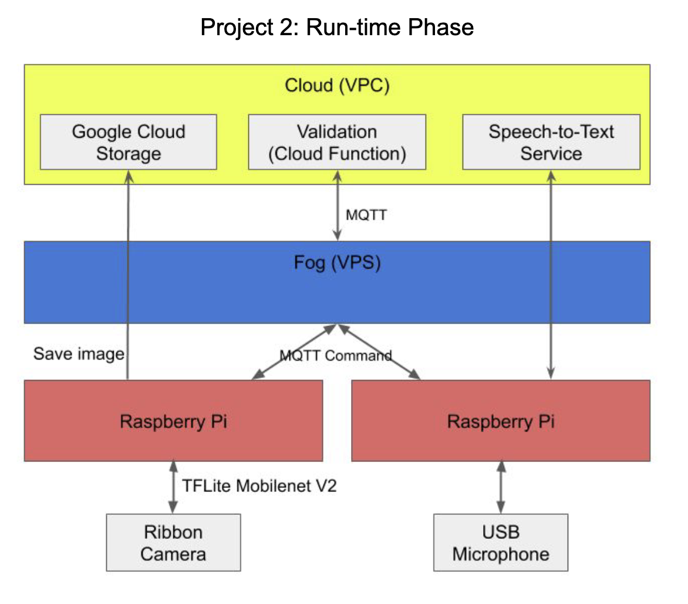

# edgeSecurityPi

A smart home edge system that authenticates users through image and voice input.

**A top-down view of our project**

- A security system that authenticates users at a door
- Use Case: Smart Home
- It uses a camera and a microphone sensors on our edge devices
- The camera detects and counts present humans
- The microphone records the audio to verify the voiced password
- If an intruder is detected and unauthorized, the camera will store an image of the target
- The system will text users when unapproved access is detected

**Device Catalog**

1. Raspberry Pi 3B
   1. Processor name: Broadcom BCM2835
   1. Cache size: L1: 32 KB; L2: 512 KB
   1. Instruction set: ARMv8-A (64/32-bit)
   1. Clock rate: 1.2 GHz
   1. Power consumption: Average: 1.5 W; Max: 6.7 W
1. Raspberry Pi 4B
   1. Processor name: Broadcom BCM2711; 
   1. Cache size: 1MB total
   1. Instruction set: ARMv8-A (64/32-bit)
   1. Clock rate: 1.5 GHz
   1. Power consumption: TDP 4W
1. OpenVZ Cloud Linux Instance
   1. Processor name: Intel Xeon CPU E5-2650 v2
   1. Instruction set: X86\_64
   1. Cache size: 10MB total
   1. Clock rate: 3.019GHz
   1. Power consumption: TDP 95W
1. Google Coral TPU

**Challenges**

- Difficulty differentiating the Cloud and Fog (division of labor)
- Figuring out how to communicate between edge devices using MQTT gateway
- Understanding the different functionalities of MQTT protocol and Google IOT core.
- Coordination between edge devices to avoid jump-ahead and minimize waiting time
- Understanding how to subscribe and publish information to pub/sub topics
- Final integration of subsystems required in-depth conversation over Zoom
- Maintaining reliability when Internet connectivity is poor

**Services**

- Google Cloud Speech-to-Text
  - Real-time conversion of audio to text
  - Detected the end of a phrase
- Google Cloud IoT Core
  - The hub for gateway and edge devices
- Google Cloud Pub/Sub
  - Allows for filtered messages depending on source (IoT Gateway or Edge devices)
- Google Cloud Storage
  - Stores the images where the password was incorrect so it can be reviewed later.

**Quality Attributes**

- Security
  - We are using the AES algorithm to encrypt password in pre-transmission and decrypt password post-transmission
  - We use a common cipher shared between Cloud Functions and VoicePi for encryption
- Privacy
  - Audio is discarded after conversion to text to protect voice privacy of the user
  - Pictures are only saved if the password is incorrect. Pictures of intruders are sent to the cloud and the system will send a text message with a link to the picture to the owner.
- Reliability
  - In addition to timeout and subscription check, we use a hybrid of low and high QoS communication through MQTT to ensure delivery and maximize reliability.

**Messaging Patterns and Communication Protocols**

- Messaging Pattern: Pub/Sub
  - Sub: During communication between edge devices, we pick “MQTT command”. The message will start out from the origin Pi to Google IoT API, reaching the “Command” topic of the target Pi, then reach that device through the Sub structure (source → broker → subscriber).
  - In order to receive MQTT command, the edge device must first subscribe to “/device/{deviceId}/commands/#”.
- Communication Protocol: MQTT
  - Device ID (e.g. “microphone-1”, “camera-1”)
  - Action = “Event”
  - Data/payload (Encrypted for password)
- QoS: We find a combination of QoS levels 0 and 2 to be best suitable for our application. Since we are using Command topic, we want fast, lightweight communication. On the other hand, when we want to guarantee delivery, we send the message as a QoS 2 configuration through MQTT and not requiring in-time feedback from the target device. In this way, we are able to balance speed and reliability.

**Improvements from feedback**

- **Feedback 1**: Something to add would be encryption when sending messages. Especially sending things like passwords and pictures of people can be a liability. -- Anon
  - Improvements: We added AES encryption (pycrypto library) with a shared common cipher used by the Google Cloud function and the VoicePi to encrypt and decrypt the password.
- **Feedback 2**: One thing I would think about is making the security system send notifications to users’ cellphones when someone tries to unlock and fails. This will provide an extra layer of security over just saving the image and not giving users enough reaction time.
  - Improvements: The system will text users when unauthorized access is detected. The text message includes a warning and a link to the captured image.

